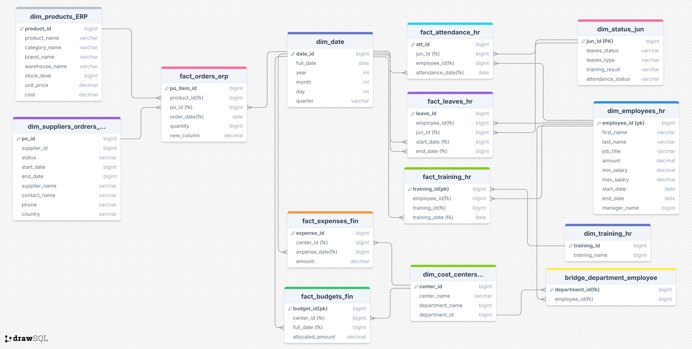
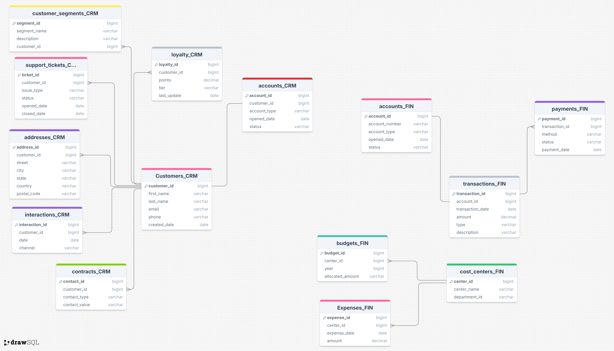
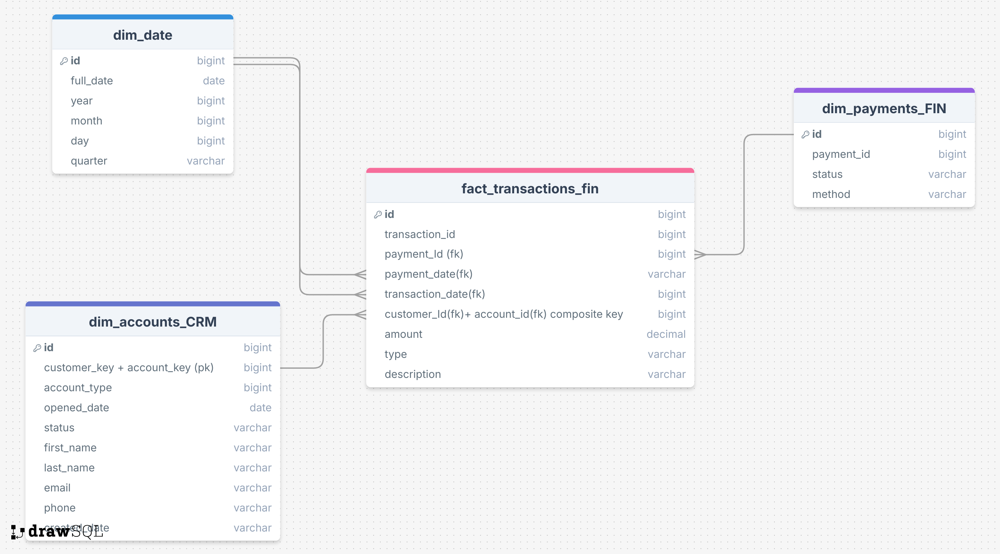

# 
**Modeling Overview**

- ### **Building a data model as an OLAP system to provide reporting to stakeholders from four systems: CRM, Finance, HR, and ERP**
  - ## **After collecting Requirments according to** 
  - ### **Making a Data Dictionary that documents the metadata of four source systems—CRM, HR, ERP, and Finance—by listing each table and its attributes, along with descriptions and their source systems, to support consistent understanding and accurate reporting** 
  - 
- # **ERD of ERP & HR systems**
- 
- 

- # **ERD of CRM & HR Finance systems**
- 

- ________

 # **Unfortunately, due to limitations on the website, I had to split DWH it into two images**
  - # **DWH part_1**
  - 
  -  - # **DWH part_2**
  - 
  - ________
  
 # **Last but not least, implementaion of it**
- 
- 
  - ## **I am pleased that you viewed my repository to the end. Thank you**
